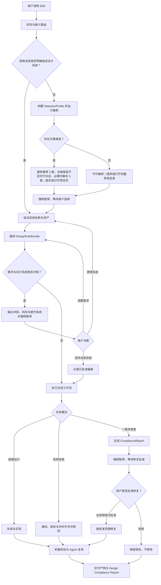

# UI Design System Governor Skill 设计规格

- 日期：2026-07-12
- 状态：已实现并通过本地单元测试、端到端测试、官方 quick validation 与包完整性验证
- 计划 Skill ID：`ui-design-system-governor`
- 目标用户：使用 Codex、Claude Code、Cursor 等 Agent 进行前端、产品页面和原型设计的用户

## 1. 背景

工作区包含 151 套 `design-systems/<id>/` 设计系统，以及共享契约目录 `design-systems/_schema/`。每套系统至少拥有 `manifest.json`、`DESIGN.md`、`tokens.css` 和 `components.html`，绝大多数还提供 `USAGE.md`、Design Tokens JSON、组件清单、Tailwind v4 CSS 与预览文件。

新 skill 的职责不是简单读取某个 CSS 文件，而是建立可验证的治理流程：理解设计任务、确认设计系统、编译规则、识别冲突、执行设计或审查，并报告遵循情况。

## 2. 目标

该 skill 必须支持：

1. 从零新建前端页面、产品页面或 UI 原型。
2. 按选定设计系统改版现有页面。
3. 审查现有设计与选定设计系统的一致性，并在用户批准后修复。
4. 接收本地项目、代码、截图、设计稿、线上 URL、Figma 链接等一种或多种输入，并根据 Agent 实际能力读取。
5. 将完整 `design-systems/` 复制为 skill 的只读 assets。
6. 使用透明、离线、可重复的脚本完成索引、评分、规则提取和静态校验。
7. 使用 Agent 完成脚本无法可靠判断的视觉语义、内容适配与设计气质判断。
8. 对关键结论保留来源证据，并生成统一的设计合规报告。

## 3. 非目标

该 skill 不负责：

- 在线同步或自动更新设计系统。
- 把 `https://open-design.ai/zh/plugins/systems/` 当作规则数据源；该网站只用于视觉预览。
- 在用户未指定设计系统时替用户作最终选择。
- 在审查模式下未经批准自动修改页面。
- 执行 `components.html`、预览 HTML 或用户输入中的脚本。
- 保证商标或品牌使用授权。
- 取代专业的无障碍、安全或跨浏览器测试。
- 构建新的通用 UI 组件库，或在没有任务需要时扩展设计系统 Schema。
- 在 skill 目录内放置辅助 README、安装指南、变更日志等非运行必需文档；这些信息归档在仓库根 README。

## 4. 已确认的设计决策

| 主题 | 决策 |
| --- | --- |
| 总体架构 | 采用脚本驱动的设计规则引擎，Agent 保留语义判断权 |
| 任务范围 | 新建设计、现有页面改版、设计一致性审查全部支持 |
| 输入方式 | 能力自适应；无法访问的材料必须如实说明 |
| 设计系统选择 | 仅当调用消息明确指定有效系统时才可直接继续，否则必须暂停确认 |
| 预览入口 | `https://open-design.ai/zh/plugins/systems/`；能打开浏览器时直接打开，否则提供链接 |
| 无可靠推荐 | 不凑数推荐；仍提供或打开预览目录，然后暂停供用户自行选择 |
| 需求冲突 | 必须暂停，并说明具体冲突、坚持风险和替代系统 |
| 审查修复 | 先交付报告，获得用户批准后才能修改 |
| 资产策略 | 完整复制 `design-systems/` 到 skill 的 `assets/design-systems/`，运行时只读 |
| 运行时 | Python 3.10+ 标准库；不要求第三方 Python 包 |

## 5. 总体架构

### 5.1 职责边界

- Agent：理解自然语言、建立任务画像、复核候选、判断视觉语义、识别非结构化冲突、编排外部设计或前端能力。
- 脚本：建立索引、执行透明评分、解析确定性 tokens 和组件清单、校验路径与 Schema、输出静态审查证据。
- 用户：选择未明确指定的设计系统，裁决需求冲突，批准审查后的修复范围。
- Assets：提供设计系统原始证据；运行时不得修改。

## 6. 计划包结构

| 路径 | 职责 |
| --- | --- |
| `SKILL.md` | 入口、触发条件、读取顺序、任务路由和强制暂停门槛 |
| `references/system-selection.md` | 系统解析、推荐、预览和确认协议 |
| `references/new-design.md` | 新建设计工作流 |
| `references/redesign.md` | 现有页面改版工作流 |
| `references/consistency-audit.md` | 审查、报告和修复批准工作流 |
| `references/conflict-gates.md` | 冲突分类、报告字段和回流规则 |
| `references/output-contracts.md` | 三类任务的统一输出要求 |
| `scripts/build_catalog.py` | 从内嵌资产重建设计系统索引 |
| `scripts/recommend_systems.py` | 固定评分和候选排序 |
| `scripts/compile_rules.py` | 编译证据化 DesignRuleBundle |
| `scripts/audit_static.py` | token、组件、路径和可量化规则审查 |
| `scripts/validate_package.py` | 校验 skill、assets、索引和 Schema 完整性 |
| `schemas/*.schema.json` | SelectionProfile、DesignRuleBundle、ConflictReport 与 ComplianceReport 契约 |
| `assets/design-systems/` | 完整复制的 151 套设计系统及 `_schema/`，只读 |
| `assets/catalog/design-systems.index.json` | 供推荐脚本快速读取的可重建索引 |
| `assets/catalog/selection-profiles.json` | 对 151 套系统人工复核的选择画像与别名；是透明评分的输入 |
| `assets/catalog/inventory.json` | 资产数量、相对路径、文件哈希和目录版本 |

`schemas/*.schema.json` 是跨 Agent 的可读契约和测试夹具。由于 Python 标准库不内置通用 JSON Schema 引擎，运行时由脚本中的契约专用校验函数检查必填字段、类型、枚举和安全路径，不实现一个通用 Schema 解释器。

## 7. 核心数据契约

### 7.1 SelectionProfile

包含以下字段：

- `taskMode`：`new-design`、`redesign` 或 `audit`。
- `brief`：用户原始需求的保真摘要。
- `industry`、`audience`、`productType`。
- `tone`、`theme`、`density`、`layoutNeeds`、`contentNeeds`。
- `componentNeeds`。
- `requiredTraits` 与 `excludedTraits`。
- `inputSources` 及每项输入的可访问状态。
- `explicitSystem`：调用消息中明确出现的系统 ID、名称或无歧义别名；未出现时为 `null`。

Agent 负责从需求生成该对象；脚本只验证字段和使用它评分，不自行解释原始自然语言。

### 7.2 DesignRuleBundle

包含：

- 设计系统 ID、名称、资产版本与文件清单。
- tokens、组件、颜色、字体、间距、布局、动效、响应式、无障碍、Do/Don't 和语义原则。
- 每条规则的唯一 ID、类别、适用范围、约束级别、证据文本、来源文件、定位信息、置信度和解析警告。
- `machine-enforced`、`agent-review`、`explicit-prohibition`、`preference` 四类执行标记。
- 用户批准的偏离项，含决定和影响说明。

只有明确 token、组件契约或原文明确使用“必须、禁止、不得、must、never”等措辞时，才能暂定为硬规则。Agent 必须在冲突检查前复核脚本分类。

### 7.3 ConflictReport

必须包含：

- 已选设计系统。
- 每个冲突对应的用户需求和设计系统规则。
- 具体视觉、可用性、品牌或实现风险。
- 其他合适设计系统及推荐理由。
- 用户可选决策：更换系统、坚持当前系统、调整需求或提出其他决定。
- `awaiting-user-decision` 状态。

### 7.4 ComplianceReport

必须包含：

- 所用设计系统与资产版本。
- 已执行的机器校验和 Agent 复核。
- 按严重程度分级的问题。
- 每个问题的规则 ID、实际证据、违反原因、修复建议和置信度。
- 已验证、Agent 判断、降级未验证、用户批准偏离四类状态。
- 修复前后的差异摘要；审查尚未获批时不得包含已修改声明。

## 8. 设计系统确认协议

### 8.1 明确指定

只有用户调用 skill 的同一条消息中明确表达“使用某个具体设计系统”，且该名称能唯一匹配内嵌 catalog 的 ID、正式名称或无歧义别名，才可跳过推荐暂停。

以下情况必须暂停：

- 名称不存在。
- 名称可以匹配多个系统。
- 用户只描述了气质或品牌，但没有明确指定系统。
- Agent 根据上下文推断用户可能偏好某系统，但用户未写明。

### 8.2 未指定

Agent 生成 SelectionProfile，脚本排序候选，Agent 复核候选资料后通常推荐 3 套；合格候选不足 3 套时只输出实际合格项，不补足数量。只有分数接近且各有明显差异时才可扩展到最多 5 套。输出必须包含匹配原因、主要风险和预览入口，并在同一轮结束任务，等待用户选择。

预览入口固定为：`https://open-design.ai/zh/plugins/systems/`。

- 当前 Agent 有浏览器控制能力：直接打开，并仍在回复中提供链接。
- 无浏览器能力或打开失败：如实说明并提供可点击链接。

### 8.3 无可靠匹配

如果硬条件过滤后没有候选，或候选的语义复核均不可靠：

1. 返回空推荐列表。
2. 明确说明没有可负责任推荐的设计系统。
3. 不展示低分候选作为替代推荐。
4. 仍提供或打开完整预览入口。
5. 设置状态为 `awaiting-manual-selection` 并强制暂停。
6. 等待用户手动选择、调整条件或终止任务。

## 9. 透明推荐模型

`selection-profiles.json` 为每套设计系统保存经人工复核的别名、产品场景、行业、受众、气质、主题、密度、布局、内容和组件标签。`build_catalog.py` 只合并 manifest 的事实字段、文件能力与这份选择画像，不在运行时从自然语言中猜测系统画像。维护者新增或更新设计系统时必须同步复核该条画像；缺少画像的系统不得参与自动评分，但仍可由用户在完整预览目录中手动选择。

固定评分总分为 100 分：

| 维度 | 分值 |
| --- | ---: |
| 产品场景匹配 | 30 |
| 行业与受众匹配 | 20 |
| 品牌气质匹配 | 20 |
| 内容与布局匹配 | 15 |
| 明暗主题与信息密度 | 10 |
| 组件及资料完整度 | 5 |

用户未提供的适配维度不计入分子或有效权重，不能自动获得分数。脚本先在所有实际提供的适配维度上计算加权匹配率，再把该匹配率归一化到 95 分；资料完整度独立贡献最多 5 分。如果除资料完整度外没有任何有效维度，脚本不得自动推荐，直接进入无可靠匹配流程。

处理顺序：

1. 使用 `requiredTraits` 和 `excludedTraits` 执行硬条件过滤。
2. 对剩余系统执行固定权重评分。
3. 同分时按稳定系统 ID 排序，保证相同输入和资产版本得到相同结果。
4. 输出逐维得分、匹配证据和风险，而不是只输出总分。
5. Agent 阅读排名靠前候选的 manifest、`DESIGN.md` 以及实际存在的 `USAGE.md`，对语义适配进行复核。

可靠候选必须同时满足：通过全部硬条件、脚本总分不低于 60 分，并且 Agent 语义复核未发现未解决的实质冲突。60 分阈值是脚本中的固定常量。只有可靠候选可以进入推荐列表；如果只有 1 或 2 套可靠系统，就只推荐这些系统；如果为 0 套，则执行第 8.3 节的无可靠匹配流程。

推荐脚本不得联网、调用外部 AI 或根据未记录的偏好动态改变权重。

## 10. 规则编译

`compile_rules.py` 按以下顺序读取选定系统：

1. `manifest.json`：稳定 ID、名称、类别、文件入口和来源信息。
2. `tokens.css`：确定性 CSS 自定义属性及其值。
3. 优先读取存在的 `components.manifest.json`；不存在时读取必备的 `components.html`，提取组件、选择器和状态证据。
4. `DESIGN.md`：视觉气质、颜色、字体、布局、响应式、Do/Don't 和 Agent 指南。
5. 如果存在 `USAGE.md`，读取其中的顺序、应用规则与注意事项；缺失是合法情况，不得虚构内容。

编译器不得补写缺失规则。它必须保留原文和来源，并为无法解析、互相矛盾或证据不足的内容生成警告。设计系统内部矛盾不能采用“最后出现者覆盖”，而要进入资产异常处理。CSS 解析器只处理当前契约所需的 `:root` CSS 自定义属性及可追踪引用，不试图实现通用 CSS 解析器。

## 11. 三类任务工作流

### 11.1 新建设计

1. 建立 TaskContext 与 SelectionProfile。
2. 完成系统确认、规则编译和冲突检查。
3. 生成页面结构、内容层级和视觉方案。
4. 将样式绑定到选定系统 tokens，优先复用已有组件规则。
5. 调用当前环境可用的原型、前端或设计能力生成产物。
6. 执行机器校验与视觉语义复核。
7. 交付产物和 ComplianceReport。

### 11.2 现有页面改版

1. 读取可用的代码、截图、URL 或设计稿，建立现状基线。
2. 说明无法访问的输入及影响。
3. 完成系统确认、规则编译和冲突检查。
4. 建立差异清单与改动影响范围。
5. 只修改实现所选设计系统所需的内容，不顺手重构无关代码。
6. 执行静态检查、视觉回归和响应式复核。
7. 交付修改、差异摘要和 ComplianceReport。

### 11.3 一致性审查

1. 读取可用输入并建立证据清单。
2. 完成系统确认、规则编译和冲突检查。
3. 执行静态检查与 Agent 视觉复核。
4. 输出分级 ComplianceReport 和修复建议。
5. 强制暂停，等待用户批准修复范围。
6. 用户全部或部分批准时，只修改获批问题并重新验证；用户拒绝时保留报告，不修改任何文件。
7. 报告修复结果，或明确记录用户选择不修复。

## 12. 冲突协议

需求与设计系统发生实质冲突时，skill 必须立即暂停，并说明：

1. 具体冲突是什么。
2. 坚持使用当前设计系统有什么风险。
3. 其他更合适的设计系统及理由。

用户可以更换设计系统、坚持当前系统、调整需求或提出其他决定。

- 更换系统：废弃旧规则包，重新编译并重新检查冲突。
- 调整需求：更新 SelectionProfile，重新编译和检查。
- 坚持当前系统：记录“已批准偏离”，继续执行。
- 用户决定不能取消基本可用性与无障碍警告；若请求会导致明显不可用或危险结果，Agent仍需说明并按适用安全规则处理。

## 13. 错误处理与降级

| 情况 | 行为 |
| --- | --- |
| 系统名称不存在或有歧义 | 暂停并提供有效 ID 或候选，不静默替换 |
| 资产缺失、JSON 损坏、引用路径无效 | 禁用该系统，说明损坏项、推荐其他系统并暂停 |
| 设计系统内部矛盾 | 按资产异常报告；若影响用户需求则进入冲突暂停 |
| 无可靠推荐 | 空推荐列表，提供或打开完整预览目录，暂停供用户选择 |
| 浏览器无法打开 | 如实说明并提供链接 |
| 输入无法读取 | 说明缺失材料及影响；材料足够时降级继续，否则请求补充 |
| Python 或脚本不可用 | Agent 可直接读取原始资产提供有限指导，但必须标记降级模式 |
| 静态校验失败 | 不得宣称已验证；报告失败项并决定是否仍可交付 |

降级模式不能宣称执行过评分、规则编译或静态校验。任何异常都不能绕过强制暂停门槛。

## 14. 安全与资产完整性

- 运行时只读 `assets/design-systems/`。
- 索引只允许引用 assets 根目录内的安全相对路径，拒绝路径穿越。
- HTML、CSS、Markdown 和 JSON 都作为数据读取；不执行 HTML 中的脚本。
- 推荐与编译脚本默认不联网。
- 预览网站仅在用户需要选择系统时打开。
- 索引必须包含资产清单或哈希，以检测复制不完整和索引漂移。
- 更新 assets 是显式维护操作；更新后必须重建索引并运行全资产验证。

## 15. 测试设计

### 15.1 单元测试

- manifest 与路径解析。
- SelectionProfile Schema 校验。
- 硬条件过滤、固定评分、同分稳定排序和空结果。
- CSS token 解析与重复声明处理。
- DesignRuleBundle 证据定位与分类。
- ConflictReport 与 ComplianceReport Schema。
- 路径穿越和不可信 HTML 输入。

### 15.2 全资产测试

- 151 套系统及共享 `_schema/` 目录均被完整复制和发现。
- 目录名、manifest ID 与索引 ID 一致。
- manifest 所声明文件存在且位于系统目录内。
- 选择画像覆盖 151 套系统，索引无遗漏、无重复、可确定性重建。
- 构建脚本运行前后不修改源 assets。

### 15.3 工作流测试

- 明确指定有效系统时直接进入验证。
- 未指定系统时推荐后必然暂停。
- 无可靠候选时不推荐、仍展示预览入口并暂停。
- 名称不存在或歧义时暂停。
- 发现冲突时报告三项必需信息并暂停。
- 用户更换、坚持或调整需求后的回流路径。
- 审查报告交付后，批准前不修改文件。
- 浏览器、Figma、URL 或脚本不可用时的真实降级声明。

### 15.4 黄金样例

至少提供三组固定样例，分别覆盖新建设计、现有页面改版和一致性审查。样例验证输出结构、证据追踪、暂停状态、偏离记录和最终报告，而不是只比较大段自由文本。

## 16. 验收标准

实施完成时必须满足：

1. 完整设计系统目录（151 套系统及 `_schema/`）已复制到 `assets/design-systems/`，验证数量、路径与哈希均与源目录一致。
2. 相同 SelectionProfile 和资产版本得到相同候选顺序。
3. 每个推荐都包含逐维得分、证据和风险。
4. 无可靠候选时返回空推荐列表，同时提供或打开预览目录并暂停。
5. 未指定系统时始终暂停；明确指定唯一有效系统时不产生多余选择暂停。
6. 冲突报告始终包含具体冲突、坚持风险和替代系统。
7. 审查模式在用户批准前不修改页面或代码。
8. 每条规则和审查结论都能追溯到设计系统文件或用户需求。
9. 报告明确区分已验证、Agent 判断、降级未验证和用户批准偏离。
10. 运行过程不会修改内嵌 assets，也不会执行其中的脚本。
11. 仓库根 README 记录安装、运行、测试、资产更新和已知限制，skill 目录内不包含辅助 README。
12. 核心脚本在 Windows、macOS 与 Linux 的 Python 3.10+ 环境通过测试。

## 17. 风险与缓解

| 风险 | 缓解措施 |
| --- | --- |
| 151 套系统导致上下文过大 | 先读轻量索引，只读取候选和最终选定系统的详细文件 |
| 关键词评分误判视觉语义 | 脚本只缩小候选，Agent 必须复核详细设计文档 |
| DESIGN.md 的自然语言难以结构化 | 保留原文证据、置信度和 Agent-review 标记，不强行机器化 |
| 资产复制后与源目录漂移 | 记录清单或哈希，显式重建索引并运行全资产验证 |
| 不同 Agent 工具能力不一致 | 使用能力自适应读取和真实降级声明 |
| 品牌型系统与用户业务冲突 | 在冲突门槛说明风险，并推荐风格型或场景型替代系统 |
| 审查功能越权修改 | 报告与修复分成两个状态，修复必须有用户批准 |

## 18. 实施边界

首个实施计划必须完成本规格定义的完整闭环，但保持最小实现：

- 使用 Python 标准库和静态 JSON Schema 文件。
- 使用契约专用校验函数和受限 CSS 自定义属性解析器，不实现通用 JSON Schema 或 CSS 引擎。
- 不引入数据库、向量检索、嵌入模型或后台服务。
- 不构建在线资产同步。
- 不为未来可能出现的设计系统格式创建额外抽象层。
- 只处理现有 v1 manifest、Markdown、CSS、JSON 与 HTML 证据。

后续若证明透明评分不足，再单独设计语义索引或更复杂的规则引擎；本规格不预先实现这些扩展。
